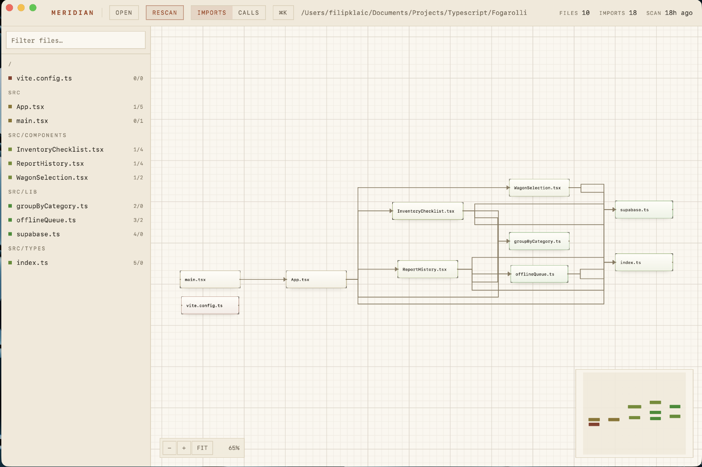
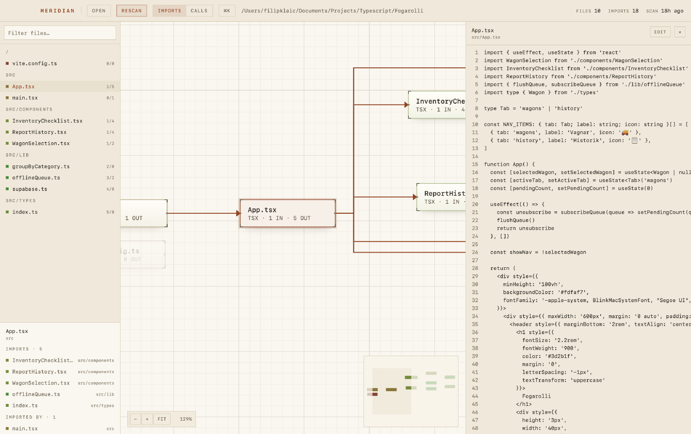

# Meridian

[](https://github.com/FilipKlaic/Meridian/actions/workflows/ci.yml)

A desktop app for looking at how a TypeScript codebase fits together. Point it at a
project folder and it charts which files import which, which functions call which, and
shows you the source behind any of it — without leaving the app.



Built with [Tauri](https://tauri.app) (Rust backend, WebView frontend), parsing with
[tree-sitter](https://tree-sitter.github.io), rendering with
[React Flow](https://reactflow.dev) and [dagre](https://github.com/dagrejs/dagre).

## What it does

- **Import graph** — one node per `.ts`/`.tsx` file, one edge per internal import.
  Files are coloured by directory, so packages separate visually.
- **Call graph** — functions, methods and classes, anchored on one file at a time:
  everything it declares plus everything one hop away in either direction.
- **Source viewer** — click any node to read the code behind it, with a button to jump
  to the same line in VS Code.
- **Focus mode** — hovering a node dims everything it does not touch.
- **Scan cache** — results are stored in SQLite per project path, so reopening a
  project draws immediately instead of rescanning. The header says how many files have
  changed since, so a stale graph never passes for a current one.

Edges follow the lanes dagre reserves for them, so lines route around boxes rather than
through them, and labels drop away as you zoom out instead of turning into mush.



## Running it

Requires [Node](https://nodejs.org) and a [Rust toolchain](https://rustup.rs), plus
Tauri's [system dependencies](https://tauri.app/start/prerequisites/) for your platform.

```bash
npm install
npm run tauri dev
```

To build a distributable app:

```bash
npm run tauri build
```

## Using it

**Open** picks a project folder, **Scan** charts it. Pick a file in the inspector on the
left — or with the command palette — and switch to the **Calls** tab to see its call
graph. Click any node to read its source.

| Shortcut | Action |
| --- | --- |
| `⌘K` | Command palette — jump to a file or run a command |
| `⌘B` | Show or hide the inspector |
| `⌘T` | Switch between the import and call graphs |
| `⌘O` | Open a project |
| `⌘R` | Rescan |
| `Esc` | Clear the selection, or close the source viewer |

## What it understands, and what it doesn't

This matters more than usual for a tool like this: a confidently-drawn incomplete
picture reads exactly like a complete one. So the limits are worth stating plainly.

**Imports.** Static `import` statements, `export ... from` re-exports, and `require()`
calls. Specifiers are resolved the way Node and TypeScript resolve them — extension
inference, `index` files, and NodeNext-style `./foo.js` meaning `./foo.ts`.

`compilerOptions.baseUrl` and `compilerOptions.paths` are honoured, so `@/components`
resolves like it does in your editor. Each file uses its nearest `tsconfig.json`, which
keeps a monorepo's packages from bleeding into each other, and `extends` and
`references` are followed so aliases declared in a `tsconfig.app.json` still count.

- Bare package imports (`react`, `lodash`) are skipped unless an alias maps them into
  the project; only files inside the project become nodes.
- An `extends` naming a package (`@tsconfig/strictest`) is not followed — it lives in
  `node_modules`, which a scan never walks. Relative and absolute ones are.
- Dynamic `import()` is not counted.

**Calls.** tree-sitter provides syntax, not types, so a call is resolved by name:

- A call to a locally declared name binds to that declaration.
- A call to an imported name binds through the import graph — named, default, aliased
  and namespace imports all work.
- `this.method()` binds within the enclosing class.
- Anything else is a method call on a value whose type is unknowable without a type
  checker. Those are matched on method name alone and shown as **guesses** — drawn
  dashed, and counted separately in the header. When the name is ambiguous, the edge is
  dropped rather than guessed at.

Expect a healthy proportion of guesses on class-heavy or dependency-injected code. If
that becomes limiting, the fix is a resolver backed by the TypeScript compiler API; the
graph shape would not change.

**Freshness.** A scan records the size and modification time of every file it read,
including the `tsconfig.json` files, since editing an alias moves edges just as much as
editing an import. Opening a project compares those against disk, and so does regaining
window focus — coming back from your editor is when the graph is most likely to be
wrong. The count appears in the header and the Rescan button turns amber to match.

Each file is compared against its own recorded state rather than against the moment of
the scan, so cloning a repository does not declare an untouched tree stale. Two things
this does not do: rescanning is still yours to trigger, and a file edited back to
identical content still counts as changed, because only its timestamp is consulted.

The source viewer is exempt — it re-reads and re-parses on every open, so the code you
see is current even when the graph around it is not.

TypeScript and TSX only, for now.

## How it works

A scan walks the project with the [`ignore`](https://docs.rs/ignore) crate, respecting
`.gitignore` and skipping `node_modules`, then parses each file once with tree-sitter.
That single parse feeds three passes: imports, declarations, and calls. Resolving calls
needs the whole project's exports first, so declarations are collected across every file
before any call is bound.

The frontend lays both graphs out with dagre and renders them with React Flow. Node
geometry — size, handle positions, measurements — is declared from the layout rather
than measured from the DOM, which keeps the first paint correct and makes rendering
independent of `ResizeObserver` timing.

```
src/                    React frontend
  App.tsx               workspace shell, tabs, shared selection state
  layout.ts             dagre layout, routing, node geometry
  callLayout.ts         the call graph, anchored on one file
  Inspector.tsx         file list, search, imports/importers
  CommandPalette.tsx    ⌘K
  SourceDrawer.tsx      the source viewer
src-tauri/src/          Rust backend
  scanner.rs            walking, import extraction and resolution
  tsconfig.rs           baseUrl and paths, for non-relative specifiers
  symbols.rs            declarations and call resolution
  source.rs             reading a declaration back off disk
```

## Development

```bash
cd src-tauri && cargo test          # scanner, resolution and source-reading tests
cd src-tauri && cargo clippy --all-targets -- -D warnings
cd src-tauri && cargo fmt
npm run build                       # typecheck and build the frontend
```

CI runs all four on every push and pull request.

There is a CLI for exercising the scanner without launching the app, which is the
quickest way to see what a real project produces:

```bash
cd src-tauri
cargo run --example scan -- /path/to/project
cargo run --example scan -- /path/to/project --json
```
